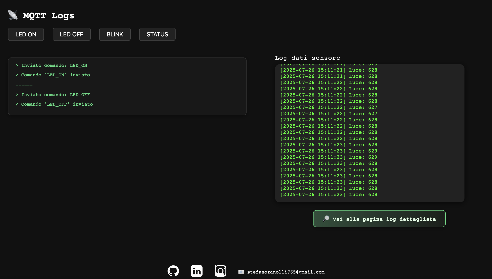
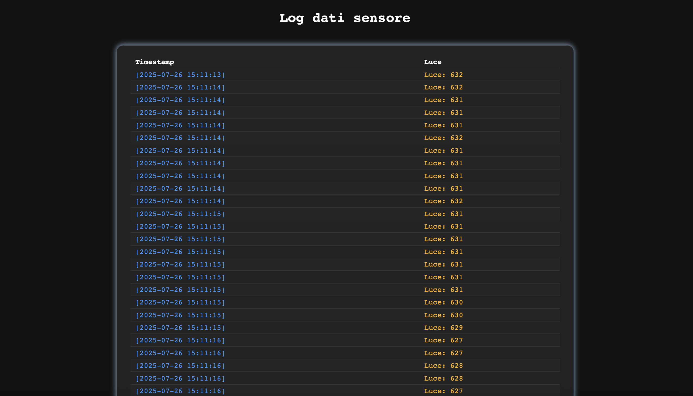

# 🚦 FirmBox-Gateway

---

## ✨ Descrizione
Sistema per monitorare la luminosità tramite una **fotoresistenza** collegata a uno **STM32F103C8T6**. I dati vengono inviati via UART a un **Raspberry Pi**, che li pubblica su **MQTT**. Un server **Flask** su PC mostra i dati in tempo reale su una dashboard web, dove l’utente può anche inviare comandi (`LED_ON`, `LED_OFF`, `BLINK`) per controllare un LED collegato allo STM32.

---

## 🗂️ Struttura del progetto
- **`PC_on_WEB/`**: server Flask (`app.py`) e file per la dashboard web (HTML, CSS, JS)
- **`Raspberry Pi/`**: script Python per:
  - leggere dati dalla UART (fotoresistenza)
  - pubblicarli su MQTT
  - ricevere comandi da MQTT e inviarli via UART allo STM32
- **`STM32/`**: firmware per:
  - leggere la fotoresistenza e inviare i dati via UART
  - ricevere comandi via UART e gestire il LED tramite il pin PB0

---

## 🛠️ Requisiti

### Hardware
- 🟦 STM32F103C8T6
- 🍓 Raspberry Pi 4 Model B
- 🔌 Modulo USB-UART CP2102
- 🟣 ST-Link V2 (per caricare il firmware)
- 🌞 Fotoresistenza (con resistenza da 10Ω in serie)
- 💡 LED (con resistenza da 220Ω in serie)

### Software
- 🐍 Python 3
- 🌐 Flask
- 📡 paho-mqtt
- 🔗 pyserial

Installa le dipendenze Python principali con:
```bash
pip install flask paho-mqtt pyserial
```

---

## ⚡ Installazione e avvio

### 1️⃣ Caricamento firmware STM32
1. Installa il supporto STM32 in Arduino IDE aggiungendo questa URL all’Additional Boards Manager:
   ```
   https://github.com/stm32duino/BoardManagerFiles/raw/main/package_stmicroelectronics_index.json
   ```
2. Seleziona la board **STM32F103C8T6**.
3. Collega lo **ST-Link V2**.
4. Imposta il metodo di upload su **OpenOCD STLink (SWD)** (vedi figura).
5. Carica il firmware (`STM32_program.ino`).

### 2️⃣ Raspberry Pi
#### 🔧 Abilita la UART e disabilita il login seriale
Apri il tool di configurazione:
```bash
sudo raspi-config
```
Vai su:
- `Interfacing Options → Serial`
- Quando chiede:
  - **Would you like a login shell to be accessible over serial?** → `NO`
  - **Would you like the serial port hardware to be enabled?** → `YES`

Esci e riavvia il Raspberry Pi:
```bash
sudo reboot
```

#### 🔑 Autorizza l’accesso alla seriale
```bash
sudo chmod 666 /dev/ttyUSB0
```
*(oppure `/dev/serial0` a seconda del caso)*

#### ▶️ Avvio degli script
Avvia gli script nell’ordine (ognuno con `python3 nomefile.py`):
1. `uart_reader.py`
2. `mqtt_publisher.py`
3. `command_subscriber.py`

### 3️⃣ PC (server Flask)
- Vai nella cartella `PC_on_WEB`.
- Avvia il server con:
```bash
python3 app.py
```

### 4️⃣ Configurazione MQTT
- Sul Raspberry Pi, il broker MQTT è su `localhost`.
- Su altri dispositivi, inserisci l’indirizzo IP del Raspberry Pi come broker MQTT.

---

## 🖥️ Come si usa
- Collegati alla dashboard web dal browser.
- Visualizza in tempo reale tutti i dati letti dalla fotoresistenza, ciascuno con il relativo **timestamp**.
- Invia comandi per controllare il LED (**accensione**, **spegnimento**, **blink**) direttamente dall’interfaccia.

---

## 📸 Immagini

-

-

-


---

## 📬 Contatti
In fondo alla pagina web trovi i miei social e la mia email per qualsiasi domanda o approfondimento.

